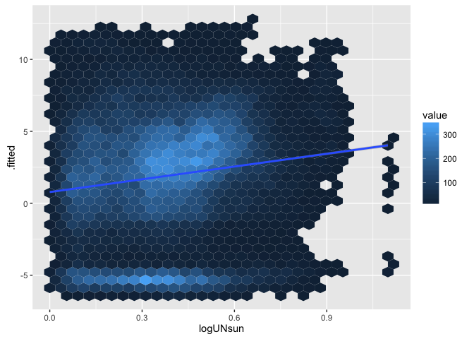
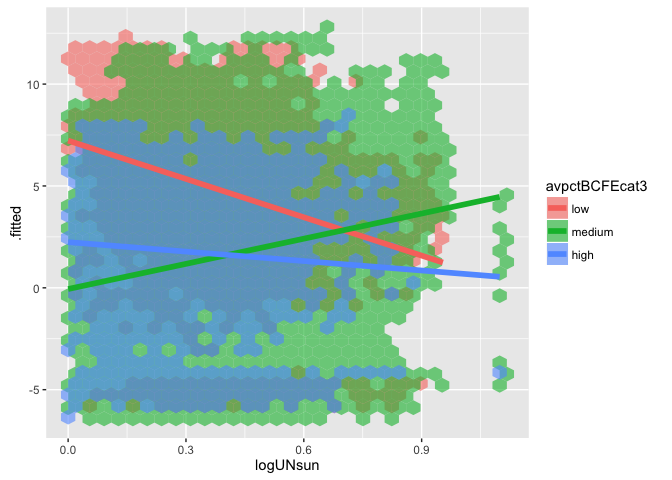
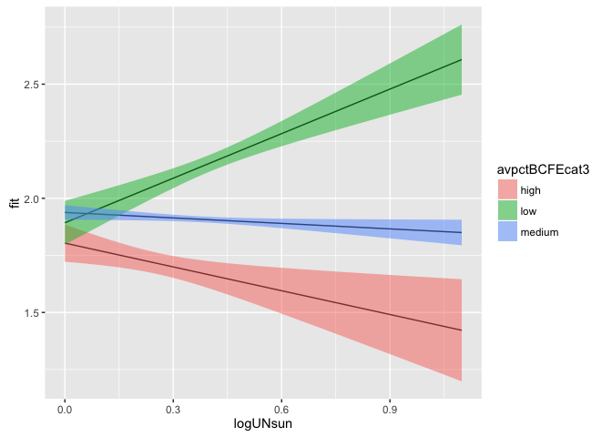
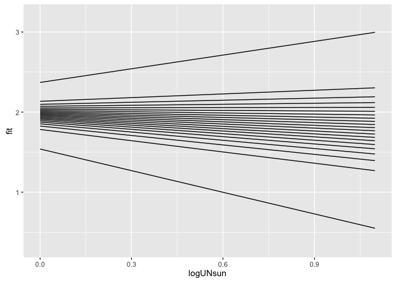
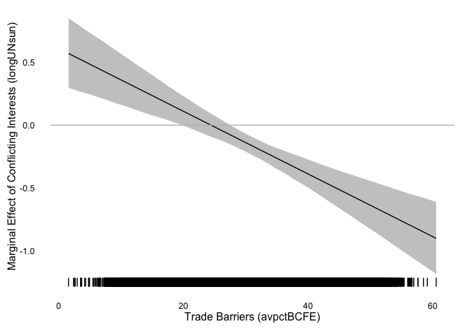

# Assignment 05
Solutions  


```r
knitr::opts_chunk$set(cache = TRUE, autodep = TRUE)
```

## Libraries Used

```r
library("pols503")
library("rio")
library("ggplot2")
library("dplyr")
library("broom")
library("xtable")
```

## Data


```r
db <- import("TradeConflict.dta")
```

## Model

This model is similar to their Model 1 in Table 1 (p. 676):

```r
mod1 <- lm(lnrtrade ~ lnrpciab + avremote + landlocked + island + 
              landratio + pciratio + jointdem + laglnrtrade +
              lnrgdpab + lndist + logUNsun * avpctBCFE, 
           data = db)
```

## Questions

**A:** Create a new variable `avpctBCFEcat3` by splitting the variable `avpctBCFE` into 3 categories. 


```r
db <- mutate(db, avpctBCFEcat3 = cut(x = avpctBCFE, breaks = 3, 
                                     labels = c("low", "medium", "high")))
```

**B:** Run a new version of `mod1` (`mod2`) but in this case ignore the interaction effect between the variables `logUNsun` and `avpctBCFE`, and substitute the variable `avpctBCFE` for the new categorical you just created.


```r
mod2 <- lm(lnrtrade ~ lnrpciab + avremote + landlocked + island + 
              landratio + pciratio + jointdem + laglnrtrade +
              lnrgdpab + lndist + logUNsun + avpctBCFEcat3, 
           data = db)
```

**C:** Plot the predicted values of the model `mod2` against the covariate `logUNsun`. Draw a linear regression line on it.


```r
pred_mod2 <- augment(mod2)
ggplot(pred_mod2, aes(x = logUNsun, y = .fitted)) + 
  stat_binhex() +
  geom_smooth(method = "lm")
```



**D:** If you used `geom_point()` in the previous plot, you probably saw that there are a lot of data points. Replicate the same plot using `stat_binhex()` instead of `geom_point()`. You can find the documentation [here](http://docs.ggplot2.org/0.9.3/stat_binhex.html).


**E:** Take a look at the plot and at the coefficient for `logUNsun` in `mod2`. What can you say about the relationship betweeh this covariate and the outcome variable `lnrtrade`?

**F:** Replicate the same plot (`logUNsun` v. fitted values of `mod2`) but in this case use again `geom_point()` and color the dots differently depending on their values for `avpctBCFEcat3`. Make sure you also plot 3 different lines describing the relationship between `logUNsun` and the predicted values of `lnrtrade` for each group of `avpctBCFEcat3`. What do you see? How would you interpret this new plot?


```r
ggplot(pred_mod2, aes(x = logUNsun, y = .fitted, fill = avpctBCFEcat3)) + 
  stat_binhex(alpha = 0.6) +
  geom_smooth(method = "lm", aes(color = avpctBCFEcat3), lwd = 2, se = FALSE)
```



**G:** Run a new model (`mod3`) similar to `mod2` but in this case interact the variables `logUNsun` and `avpctBCFEcat3`.


```r
mod3 <- lm(lnrtrade ~ lnrpciab + avremote + landlocked + island + 
              landratio + pciratio + jointdem + laglnrtrade +
              lnrgdpab + lndist + logUNsun * avpctBCFEcat3, 
           data = db)
```

**H:** Keeping all the control variables at their means, calculate the predicted values for the following scenarios:

| # | `logUNsun`     |     `avpctBCFEcat3` |
|:----|:---------|:-------|
| 1 | 0     | low |
| 2 | 1     | low |
| 3 | 0     | medium |
| 4 | 1     | medium |
| 5 | 0     | high |
| 6 | 1     | high |


```r
controls <- c("lnrpciab", "avremote", "landlocked", "island", 
              "landratio", "pciratio", "jointdem", "laglnrtrade",
              "lnrgdpab", "lndist")
scenarios <- data.frame(logUNsun = rep(c(0,1), 3),
                        avpctBCFEcat3 = c(rep("low", 2), rep("medium", 2),
                                      rep("high", 2)))
for (var in controls) {
  scenarios[,var] <- mean(db[,var], na.rm = TRUE)
}
pred_scenarios <- predict(mod3, newdata = scenarios)
```

**I:** Calculate the following:

    - `dif1`: Difference between the predicted values of scenarios 2 and 1: (`logUNsun` == 1 & `avpctBCFEcat3` == low) - (`logUNsun` == 0 & `avpctBCFEcat3` == low).
    - `dif2`: Difference between the predicted values of scenarios 4 and 3: (`logUNsun` == 1 & `avpctBCFEcat3` == medium) - (`logUNsun` == 0 & `avpctBCFEcat3` == medium).
    - `dif3`: Difference between the predicted values of scenarios 6 and 5: (`logUNsun` == 1 & `avpctBCFEcat3` == high) - (`logUNsun` == 0 & `avpctBCFEcat3` == high).
    - `dif4`: Difference between the predicted values of scenarios 3 and 1: (`logUNsun` == 0 & `avpctBCFEcat3` == medium) - (`logUNsun` == 0 & `avpctBCFEcat3` == low).
    - `dif5`: Difference between the predicted values of scenarios 5 and 1: (`logUNsun` == 0 & `avpctBCFEcat3` == high) - (`logUNsun` == 0 & `avpctBCFEcat3` == low).
    - `dif6`: Difference between `dif2` and `dif1`.
    - `dif7`: Difference between `dif3` and `dif1`.
    

```r
dif1 <- pred_scenarios[2] - pred_scenarios[1]
dif2 <- pred_scenarios[4] - pred_scenarios[3]
dif3 <- pred_scenarios[6] - pred_scenarios[5]
dif4 <- pred_scenarios[3] - pred_scenarios[1]
dif5 <- pred_scenarios[5] - pred_scenarios[1]
dif6 <- dif2 - dif1
dif7 <- dif3 - dif1
```
 
**J:** Explain in your own words what do all these differences represent.

  - `dif1`: The slope of `lnrtrade ~ logUNsun` when we only consider dyads where `avpctBCFEcat3` == low.
  - `dif2`: The slope of `lnrtrade ~ logUNsun` when we only consider dyads where `avpctBCFEcat3` == medium.
  - `dif3`: The slope of `lnrtrade ~ logUNsun` when we only consider dyads where `avpctBCFEcat3` == high.
  - `dif4`: The difference in `lnrtrade` between dyads where `avpctBCFEcat3` is low and dyads where `avpctBCFEcat3` is high, when there is no conflicting interests between the countries (`logUNsun` == 0).
  - `dif5`: The difference in `lnrtrade` between dyads where `avpctBCFEcat3` is low and dyads where `avpctBCFEcat3` is high, when there is no conflicting interests between the countries (`logUNsun` == 0).
  - `dif6`: The difference between the slopes of `lntrade ~ logUnsun` when `avpctBCFEcat3` is medium and `avpctBCFEcat3` is low 
  - `dif7`: The difference between the slopes of `lntrade ~ logUnsun` when `avpctBCFEcat3` is high and `avpctBCFEcat3` is low 
  
**K:** Create a dataset (`differences`) with all these differences


```r
differences <- data.frame(dif1, dif2, dif3, 
                          dif4, dif5, dif6, dif7)
differences
```

```
##        dif1        dif2       dif3       dif4        dif5       dif6
## 2 0.6507081 -0.08007327 -0.3476271 0.04524175 -0.08913526 -0.7307814
##         dif7
## 2 -0.9983352
```

**L:** Create and print a table showing the `mod1` coefficients, standard errors, t-statistic and p.value for only the `Intercept` and the covariates: `logUnsun`, `avpctBCFEcat3`, and their interactions. 


```r
regtab3 <- tidy(mod3)
regtab3 <- regtab3[c(1,12:nrow(regtab3)),]
regtab3
```

```
##                            term    estimate  std.error   statistic
## 1                   (Intercept) -4.35914077 0.24857807 -17.5363048
## 12                     logUNsun  0.65070810 0.11036960   5.8957183
## 13          avpctBCFEcat3medium  0.04524175 0.05091200   0.8886265
## 14            avpctBCFEcat3high -0.08913526 0.06447025  -1.3825796
## 15 logUNsun:avpctBCFEcat3medium -0.73078137 0.11457157  -6.3783834
## 16   logUNsun:avpctBCFEcat3high -0.99833520 0.17212208  -5.8001576
##         p.value
## 1  1.118084e-68
## 12 3.750183e-09
## 13 3.742074e-01
## 14 1.667989e-01
## 15 1.802485e-10
## 16 6.657977e-09
```

**M:** Compare the coefficients to the `differences` you previously calculated. Can you now interpret the coefficients?

**N:** Keeping all the other covariates at their mean, use `mod3` to predict (+ 95% confidence interval) the following 300 scenarios. Hint: create a new dataset (`scenarios2`) containing the information of all these scenarios and use it for the `newdata` argument in the `predict()` function. 

| # | `logUNsun`     |     `avpctBCFEcat3` |
|:----|:---------|:-------|
| 1 |`min(logUNsun)`     | low |
| ... | ...     | low |
| 100 | `max(logUNsun)`     | low |
| 101 |`min(logUNsun)`     | medium |
| ... | ...     | medium |
| 200 | `max(logUNsun)`     | medium |
| 201 |`min(logUNsun)`     | high |
| ... | ...     | high |
| 300 | `max(logUNsun)`     | high |


```r
scenarios2 <- data.frame(logUNsun = rep(seq(min(db$logUNsun, na.rm = TRUE),
                                            max(db$logUNsun, na.rm = TRUE),
                                            length.out = 100), 3),
                        avpctBCFEcat3 = c(rep("low", 100), rep("medium", 100),
                                      rep("high", 100)))
for (var in controls) {
  scenarios2[,var] <- mean(db[,var], na.rm = TRUE)
}
pred_scenarios2 <- predict(mod3, newdata = scenarios2, interval = "confidence")
```

**O:** Plot the predicted values against the `logUNsun` values. You should plot 3 lines, one for each group of `avpctBCFEcat3` (low, medium, high). You should also include a 95% confidence interval around each line. Hint: You need to merge first the dataset `scenarios2` with the resulting dataset from the predictions. 


```r
pred2_dataset <- cbind(scenarios2, pred_scenarios2)
ggplot(pred2_dataset, aes(x = logUNsun, y = fit, ymin = lwr, ymax = upr,
                          fill = avpctBCFEcat3)) +
  geom_line() +
  geom_ribbon(alpha = 0.5)
```



**P:** Explain in your own words what the plot is showing.

**Q:** Keeping all the other covariates at their mean, use now `mod1` (where `avpctBCFE` is contious and not categorical) to predict (+ 95% confidence interval) the following 110 scenarios. Hint: create a new dataset (`scenarios3`) containing the information of all these scenarios and use it for the `newdata` argument in the `predict()` function.

| # | `logUNsun`     |     `avpctBCFE` |
|:----|:---------|:-------|
| 1 |`min(logUNsun)`     | `quantile(avpctBCFE, 0.0)` |
| ... | ...     | `quantile(avpctBCFE, 0.0)` |
| 10 | `max(logUNsun)`     | `quantile(avpctBCFE, 0.0)` |
| 11 |`min(logUNsun)`     | `quantile(avpctBCFE, 0.05)` |
| ... | ...     | `quantile(avpctBCFE, 0.05)` |
| 20 | `max(logUNsun)`     | `quantile(avpctBCFE, 0.5)` |
| 201 |`min(logUNsun)`     | `quantile(avpctBCFE, 1)` |
| ... | ...     | `quantile(avpctBCFE, 1)` |
| 210 | `max(logUNsun)`     | `quantile(avpctBCFE, 1)` |


```r
scenarios3 <- data.frame(logUNsun = rep(seq(min(db$logUNsun, na.rm = TRUE),
                                            max(db$logUNsun, na.rm = TRUE),
                                            length.out = 10), 21),
                        avpctBCFE = as.vector(sapply(quantile(db$avpctBCFE, 
                                                              seq(0, 1, 0.05)),
                                                     function(x) rep(x, 10))))
for (var in controls) {
  scenarios3[,var] <- mean(db[,var], na.rm = TRUE)
}
pred_scenarios3 <- predict(mod1, newdata = scenarios3, interval = "confidence")
```

**R:** Plot the predicted values against the `logUNsun` values. You should plot a different line for each different value of `avpctBCFE`. You don't need to include a 95% confidence interval around these lines. Hint: Although now we are using the continuous instead of the categorical representation of the variable `avpctBCFE`, to plot different lines according to different values of `avpctBCFE`, you will need to define the variable as a `factor()` in the ggplot's aesthetics. 


```r
pred3_dataset <- cbind(scenarios3, pred_scenarios3)
ggplot(pred3_dataset, aes(x = logUNsun, y = fit, ymin = lwr, ymax = upr,
                          fill = factor(avpctBCFE))) +
  geom_line()
```



--- 

As you can see, plotting multiple lines describing the effect of *conflicting interests* (**logUNsun**) on *trade* (**lntrade**) conditional on different *trade barriers* (**avpctBCFE**) is not very helpful. To observe that conditional effect, we often use **marginal effects** plots. 

Jeff Arnold has written a new `R` package to create marginal effects plots: `marfx`. Let's use it in this example.

Load the `devtools` package and us its `install_github()` function to install the `marfx` package from `GitHub`. 


```r
library(devtools)
install_github("jrnold/marfx")
```

```
## Skipping install for github remote, the SHA1 (6a3d16d7) has not changed since last install.
##   Use `force = TRUE` to force installation
```

```r
library(marfx)
```

Create a new set of hypothetical scenarios (`sim_scenarios`). In this case keep all the controls and the key covariate of interest `logUNsun` at their mean. Only the variable that conditions the effect of our key independent variable will change: `avpctBCFE`. You want this new hypothetical dataset to have 100 rows and the values for `avpctBCFE` to range from its minium to its maximum.


```r
sim_scenarios <- data.frame(logUNsun = mean(db$logUNsun, na.rm = TRUE),
                            avpctBCFE = seq(min(db$avpctBCFE, na.rm = TRUE),
                                           max(db$avpctBCFE, na.rm = TRUE),
                                           length.out = 100))
z <- matrix(sapply(controls, function(x) rep(mean(db[,x], na.rm = TRUE), 100)),
            nrow = 100)
colnames(z) <- controls
sim_scenarios <- cbind(sim_scenarios, z)
```

Use the `mfx()` function of the `marfx` package to calculate the coefficient of `logUNsun` and a confidence interval around it for each of the hypothetical scenarios.

Give to the `mfx()` 3 parameters:

  - `x`: The regression/model object: e.g. `mod1`
  - `data`: The dataset with hypothetical scenarios: e.g. `sim_scenarios`
  - `variable`: The key covariate of interest: e.g. `logUNsun`
  
The function returns a dataset with the same number of rows than `sim_scenarios` and the following variables;

  - `estimate`: The effect (coefficient) of your key covariate on the outcome varaible
  - `std.error`: Standard error of the coefficient
  - `conf.low`: Lower bound of the confidence interval around the coefficient
  - `conf.high`: Upper bound of the confidence interval


```r
sim_scenarios <- cbind(sim_scenarios, mfx(mod1, data = sim_scenarios, "logUNsun"))
```

Plotting the marginal effect of **conflicting interests** on **trade**.

```r
ggplot() +
  geom_ribbon(data = sim_scenarios, mapping = aes(x = avpctBCFE, 
                                          ymin = conf.low, 
                                          ymax = conf.high),
              alpha = 0.3) +
  geom_line(data = sim_scenarios, mapping = aes(x = avpctBCFE, y = estimate)) +
  geom_rug(data = db, mapping = aes(x = avpctBCFE)) +
  geom_hline(yintercept = 0, color = "gray") +
  theme_minimal() +
  theme(panel.grid = element_blank()) + 
  scale_x_continuous(name = "Trade Barriers (avpctBCFE)") +
  scale_y_continuous(name = "Marginal Effect of Conflicting Interests (longUNsun)")
```




